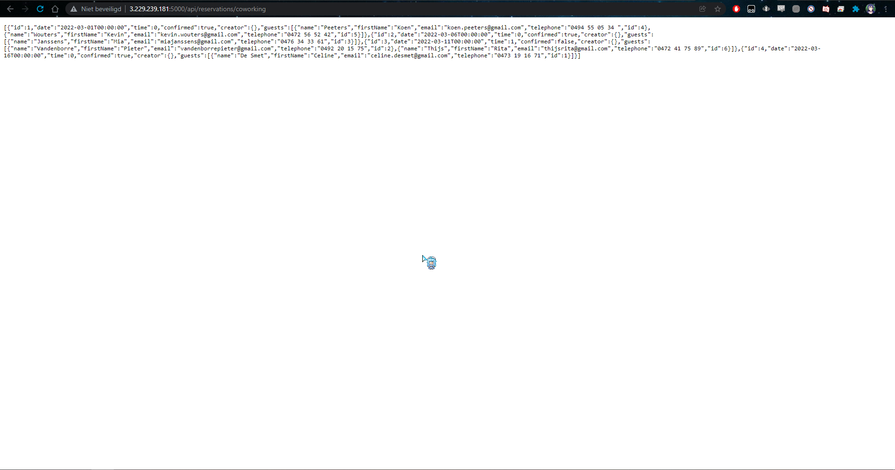

# Ubuntu VM Setup on AWS

* Na dat je de stappen hebt doorlopen in de `Vagrant setup for AWS` documentatie zal je VM aanstaan, het volgende deel zijn de stappen die je moet ondernemen om alles op de VM te krijgen dat nodig is om succesvol een `API`, `WebClient` en `DB` container te hebben die allemaal met elkaar in verbinding staan.

## Github Repository

* Allereerst gaan we een keygen genereren voor ons eigen `Github` account zodat we de `ProjAalst3-G1-Backend-Web` repository van onze programmeurs op onze AWS VM kunnen clonen.
* Gebruik het commando `ssh-keygen -t rsa -b 4096 -C "sven.devuyst.y7522@student.hogent.be"` om je keygen te genereren en druk `Enter` bij elke stap. Deze keygen zal dan in `/home/ubuntu/.ssh/` worden gezet by default.


* Kopieer de keygen die in `/home/ubuntu/.ssh/id_rsa.pub` staat en maak een nieuwe SSH key aan binnen je github account onder `Settings` --> `SSH and GPG Keys`


* Nu kan je normaal de Github repository clonen met het commando `git clone git@github.com:fwalravens/ProjAalst3-G1-Backend-Web.git`

## Docker Containers (DB & API)

* De volgende stap is het pullen van onze docker images en het opzetten van onze docker containers hiermee en er natuurlijk ook voor zorgen dat deze connectie met elkaar hebben.
* Gebruik de commando's: `docker pull renauddockerpro/hierrepo:api` en `docker pull renauddockerpro/hierrepo:db` om onze API en DB Docker images van Dockerhub te pullen.
* Nu dat we deze containers hebben zullen we eerst een netwerk aanmaken binnen Docker zelf om beide deze containers in te steken. Maak gebruik van `docker network create mynetwork` hiervoor.
* Nu gaan we daadwerkelijk de containers aanmaken en er voor zorgen dat deze allebei ditzelfde netwerk gebruiken. Maak gebruik van de volgende commando's: `docker create --name db --network mynetwork renauddockerpro/hierrepo:db` en `docker create --name api --network mynetwork renauddockerpro/hierrepo:api`
* We gaan de Docker Containers die we net aangemaakt hebben nu runnen, start eerst de DB container aangezien de API container hiermee verbinding moet maken. Maak gebruik van het volgende commando: `docker run --name mysql --network mynetwork -p 3305:3305 --env=MYSQL_ROOT_PASSWORD=example renauddockerpro/hierrepo:db`


* Open nu een nieuw venster aangezien nu in dit venster de DB container zal runnen. (Maak opnieuw gebruik van `vagrant ssh default` om te connecten met de VM)
* Nu gaan we de API container starten, maak hiervoor gebruik van het volgende commando: `docker run --network mynetwork -p 5000:5000 -e "ConnectionStrings__DefaultConnection=server=mysql;port=3306;database=mysql;uid=root;pwd=example;" renauddockerpro/hierrepo:api`
* Als alles goed verlopen is zou de API container connectie moeten hebben gemaakt met de DB en kan je nu naar `http://3.229.239.181:5000/api/reservations/coworking` surfen en zal je de API tevoorschijn zien komen.



## Docker Containers (WebClient)

* In deze laatste stap zullen we er voor zorgen dat we de WebClient Docker Container gaan opstarten, deze zal gebruik maken van de API om alle data qua reservaties in te laden.
* Ga als eerst naar de Repository van onze Developers en zorg dat je in de map `HIER.WebClient` staat. Maak gebruik van `cd ProjAalst3-G1-Backend-Web/HIER.WebClient/` hiervoor.
* Maak in deze directory twee files aan met behulp van het touch commando: `touch nginx.conf` en `touch Dockerfile`.
* We gaan nu bepaalde configuratie in beide deze bestanden steken om succesvol een Webclient docker image aan te maken en dan van deze image een container te maken. Edit de file met behulp van `vi nginx.conf`. Voeg volgende configuratie toe aan het bestand en save deze dan. (Druk `I` om te inserten, dan `ESC` en `:wq` om te schrijven)

```
events { }
   http {
      include mime.types;
      types {
         application/wasm wasm;
       }
     server {
        listen 80;
        index index.html;
        location / {
           root /var/www/web;
           try_files $uri $uri/ /index.html =404;
        }
     }
}
```

* We gaan hetzelfde doen voor de `Dockerfile`, Edit de file met `vi Dockerfile`. Voeg volgende configuratie toe aan het bestand en save deze dan. (Druk `I` om te inserten, dan `ESC` en `:wq` om te schrijven)

```
FROM mcr.microsoft.com/dotnet/sdk:5.0 AS build-env
WORKDIR /app
COPY . ./
RUN dotnet publish -c Release -o output
FROM nginx:alpine
WORKDIR /var/www/web
COPY --from=build-env /app/output/wwwroot .
COPY HIER.WebClient/nginx.conf /etc/nginx/nginx.conf
EXPOSE 80
```
* Voor dat we onze Docker image gaan builden moeten we nog een kleine aanpassingen maken aan onze `appsettings.json` in de Directory `ProjAalst3-G1-Backend-Web/HIER.WebClient/wwwroot`. Maak gebruik van `vi appsettings.json` om deze te editen. Zorg ervoor dat de `"Api"` lijn het volgende bevat: `"http://3.229.239.181:5000/api/"` (Druk `I` om te inserten, dan `ESC` en `:wq` om te schrijven)


* Nu gaan we onze Docker image builden en hiervan dan een Docker container maken waarin onze WebClient zal draaien. Zorg deze keer dat je in de Homedirectory staat door eentje naar boven te gaan met `cd ..`
* Gebruik het volgende commando om de Docker Image te builden: `docker build -t webclient -f HIER.WebClient/Dockerfile .` (Opmerking: Het kan even duren tot de image gebuild is, als je `Compressing Blazor WebAssembly publish artifacts. This may take a while...` ziet en hij blijft hier lang op staan druk je best eens op `Enter` normaal gaat hij dan wel voort.)


* Nu gaan we onze WebClient image gebruiken en deze in een Docker Container runnen net zoals de andere containers, maak hiervoor gebruik van het volgende commando: `docker run --network mynetwork -p 9000:80 -d --name client webclient`
* Als we nu surfen naar `http://3.229.239.181:9000/` zal de Homepagina van de Website verschijnen. 


* Klik nu op `Reservaties` linksboven. Heb even geduld bij deze stap, de webclient zit nu alle reservaties uit de API op te halen en zodra deze opgehaald zijn zullen ze allemaal verschijnen. (Je kan ook gaan kijken waar hij precies de data ophaalt in de Devconsole `F12` onder het `Network` tab.) 


