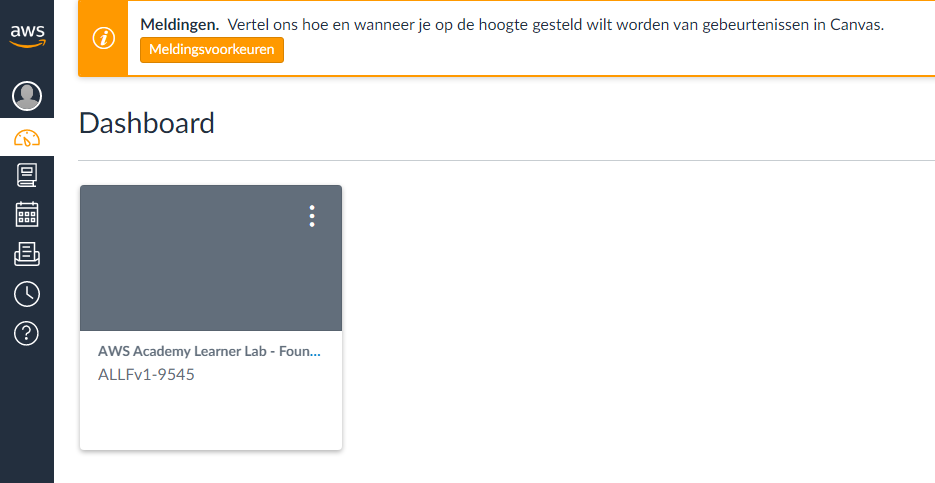
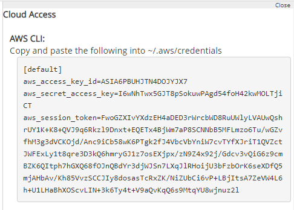
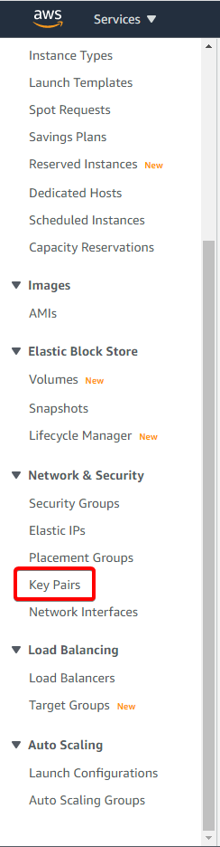
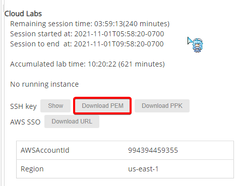
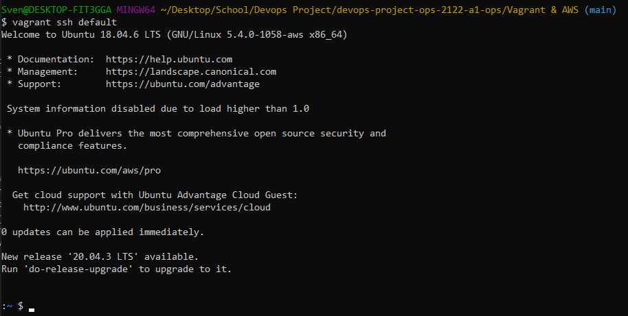
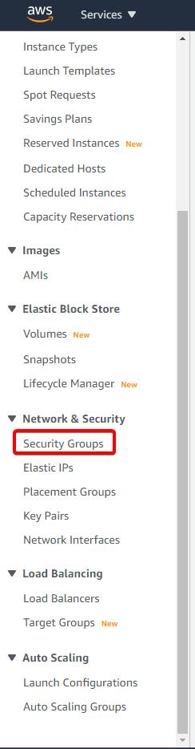
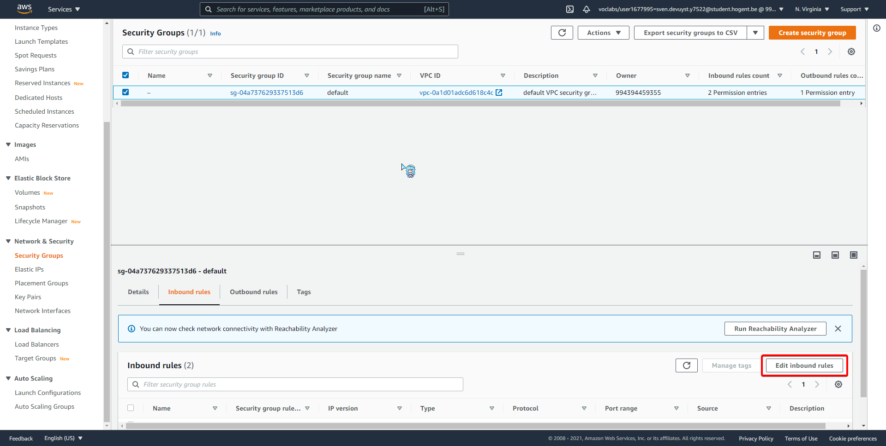

# Vagrant setup for AWS

## AWS Academy

* Aangezien er in de studiewijzer bij het vak verwezen werd naar AWS Academy gaan we van deze service gebruik maken.
* Allereerst moet je access hebben tot de "Learner Lab Module" van AWS Academy. 
* Probeer eens op `https://awsacademy.instructure.com/` in te loggen met de school e-mail normaal gezien zou u deze module moeten zien staan (Als deze er niet staat of het is niet mogelijk om in te loggen moet je eens een Teams berichtje naar Bert sturen om access te verkrijgen.):

* Start nu de module `Learner Lab - Foundational Services`. 
* Klik hierna op `Start Lab`, na even geduld te hebben zal het rondje naast `AWS` groen worden en kan je er op klikken om
in de AWS Console te geraken.

Extra: Er staat een timer van 4u op dit labo als je de timer wilt resetten kan je opnieuw op `Start Lab` klikken en zou alles normaal behouden moeten worden.
Verder wil je natuurlijk ook niet dat de timer volledig uitloopt wanneer je klaar bent met alles dus dan klik je op `End Lab` en zal je timer weer van 4u starten de volgende keer
dat je terugkomt.

## Vagrant

* Nu gaan we gebruik maken van Vagrant, er staat al een `Vagrantfile` in onze github repo.
* In deze file moet je telkens `aws.access_key_id`, `aws.secret_access_key`, `aws.session_token` aanpassen aan de gegevens die je verkrijgt via AWS Academy.

* Het kan misschien zijn dat je de `aws.keypair_name` ook moet aanpassen ga hiervoor naar de AWS Console bij de EC2 Service, hier zal je aan de zijkant `Key Pairs` vinden.

* Verder download je best ook nog eens de PEM file van AWS Academy en vervang je de PEM file die in onze github repository staat. 

* Nu gaan we de plugins `fog-aws` & `vagrant-aws` installeren zodat we de machine kunnen launchen in AWS. 
* `fog-aws` kan je makkelijk installeren via `vagrant plugin install fog-aws`.
* `vagrant-aws` kan technisch gezien op dezelfde manier geinstaleerd worden maar dit gaf mij heel wat problemen dus heb ik zelf de file gedownload van `https://github.com/bdwyertech/vagrant-aws/releases/tag/v0.8.0-bdwyertech`. Waarna je het commando `vagrant plugin install ~/PATH/TO/vagrant-aws-0.8.0.gem` kan gebruiken om deze plugin te installen.
* Hierna zou je normaal gezien `vagrant up --provider=aws` moeten kunnen runnen en zal de machine gelaunched worden in AWS.
* Hierna kan je in de machine SSH'en via `vagrant ssh default`

* Als je voor altijd blijft hangen op `==> default: Waiting for SSH to become available...` bij het uitvoeren van `vagrant up --provider=aws` kan je eens proberen naar de AWS Console te gaan. 
* Klik op `Security Groups` aan de zijkant. 
* Klik op de `default` security group en dan op `Edit Inbound rules`.
* Voeg hier een nieuwe regel toe. `Type` = `All traffic`, `Source` = `My IP` en save dan.
* Probeer opnieuw de machine te creeren.

